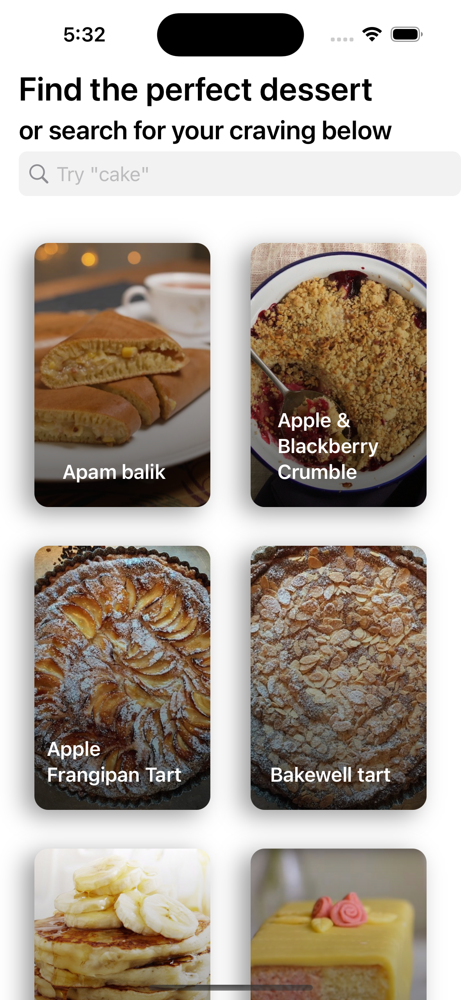
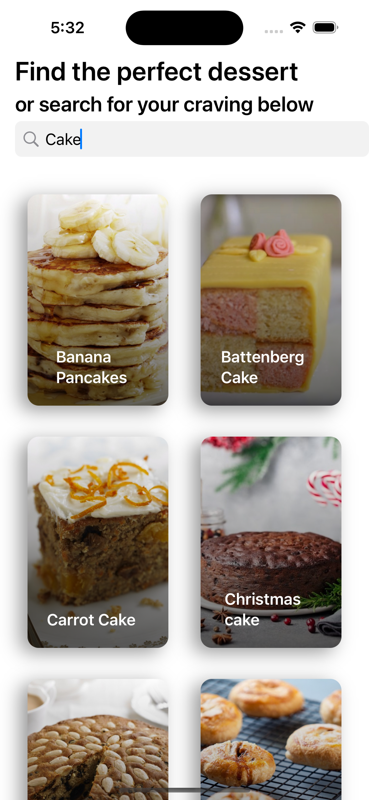
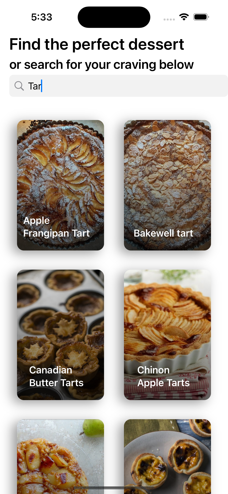
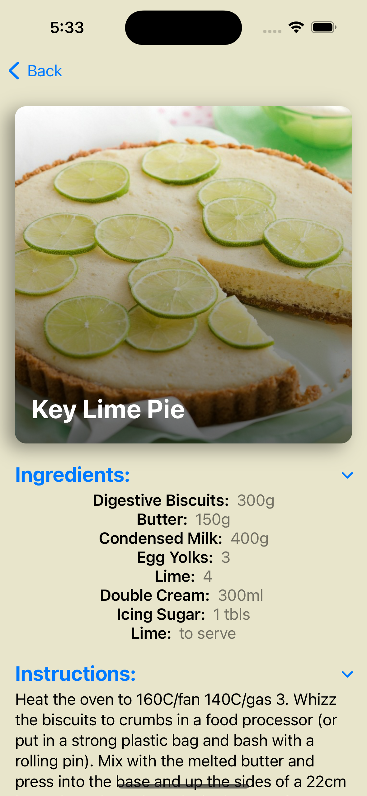
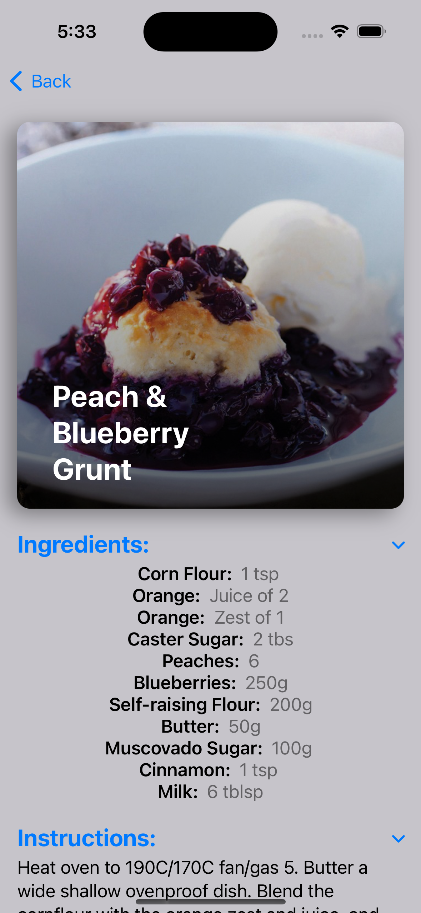

# Fetch-iOS-Exercise

This Meal App is a SwiftUI-based iOS app that allows users to browse and search for dessert recipes pulling data from TheMealDB. It provides a user-friendly interface for viewing details about each dessert which includes ingredients & measurements as well as cooking instructions.

<video width="320" height="240" controls autoplay loop>
  <source src="mealAppVid.mp4" type="video/mp4">
</video>


<div style="display: flex; flex-direction: row; justify-content: center; align-items: center;">
    
    
    
    
    
</div>

## Features

- Browse a list of meal recipes.
- Search for meals by name.
- View detailed information about each meal.
- Easily customize and extend the app.

## Requirements

- Xcode 13+
- Swift 5.5+
- iOS 15+

## Getting Started

1. Clone the repository:

   ```shell
   git clone https://github.com/yourusername/meal-app.git
   cd meal-app
